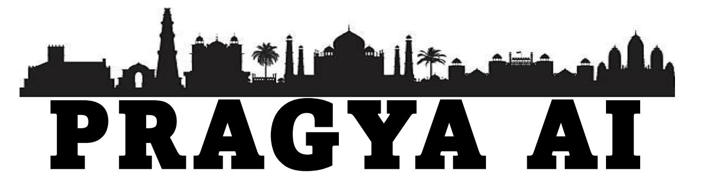
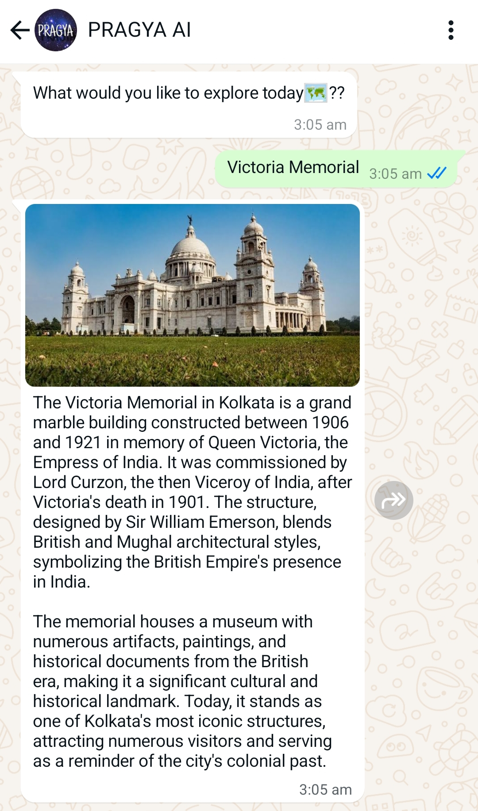
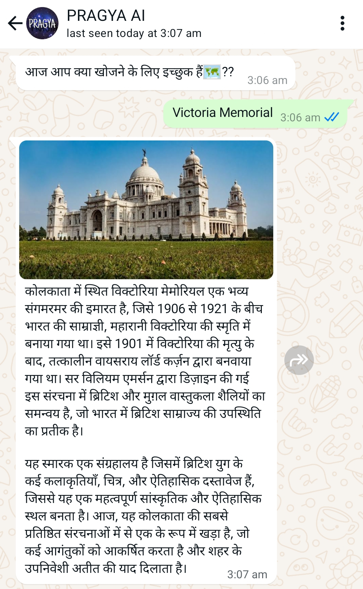
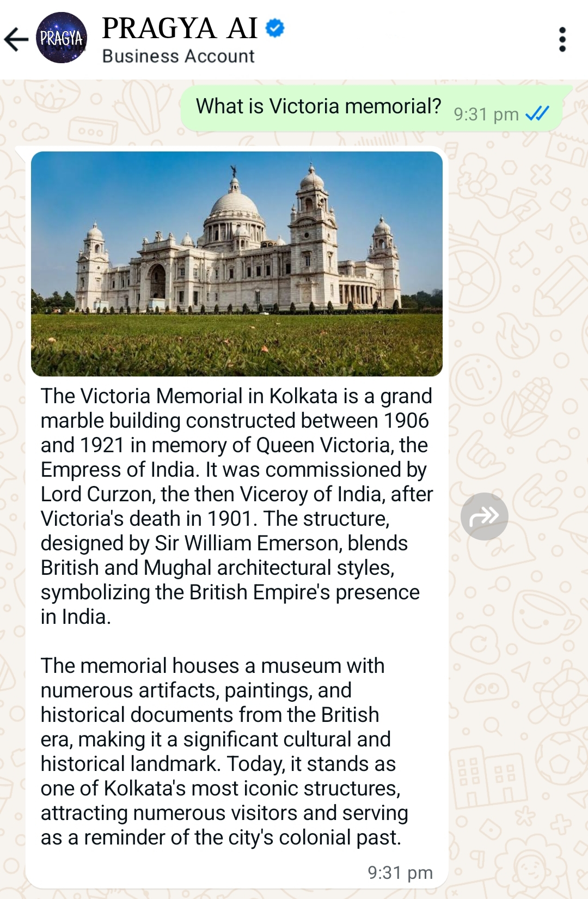

  

# Problem Statement
## Student Inovations
### Online Chatbot for ticketbooking and trip planner

# Our Solution

# Our Vision
Our vision is to revolutionize the tourism experience with PRAGYA AI, providing a seamless, efficient, and accessible platform for ticketing, personalized plans, and visitor engagement. By leveraging cutting-edge technology, we aim to make cultural experiences more accessible, inclusive, and user-friendly for all.

### 1. Accessibility for All:
PRAGYA AI is designed to be accessible to everyone, whether through its multilingual support or by using platforms like WhatsApp, helping users who find it challenging to navigate traditional web interfaces.

### 2. Personalized Itineraries:
Our system goes beyond ticketing, allowing users to create customized one-day plans based on their preferences, such as timings, dates, and interests, making their visit tailored and efficient.

### 3. Integrated Services:
PRAGYA AI now enables users to book hotels and cabs directly through the platform, providing a complete and integrated solution for planning museum visits.

### 4. Innovation:
Through constant innovation in AI and machine learning, PRAGYA AI enhances user experience by providing personalized recommendations and streamlining interactions.

### 5. Data-Driven Insights:
By collecting and analyzing visitor data, we provide museums with actionable insights that optimize operations and enhance marketing strategies, ensuring a more engaging experience for visitors.

### 6. Privacy and Security:
We prioritize the security of user data, ensuring all personal and payment information is handled securely in compliance with global privacy regulations.

# Features

  

    <!-- Left column content -->
    <h3>🌍 Multi-Language Support:</h3>
    
PRAGYA AI breaks down language barriers by offering multilingual support, ensuring accessibility for users from diverse linguistic backgrounds. Whether through WhatsApp or other platforms, users can easily interact in their preferred language, making the system inclusive and globally relevant.

  

  

    <!-- Right column content (image) -->
                               
  

  

    <!-- Left column content -->
    <h3>📱 WhatsApp Integration:</h3>
    
By leveraging WhatsApp, PRAGYA AI provides a user-friendly interface for those who struggle with navigating traditional websites. This ensures that users can book tickets, receive updates, and access services in the most convenient way possible.

  

  

    <!-- Right column content (image) -->
    
  

  

    <!-- Left column content -->
    <h3>🧠 LLAMAv3.1 -Based Query Assistant:</h3>
    
With the integration of a sophisticated LLAMA2-based AI assistant, PRAGYA AI enhances user interactions by allowing natural language queries. Whether it’s booking tickets, planning a day, or seeking recommendations, users can communicate effortlessly, with instant responses and personalized support.

  

  

    <!-- Right column content (image) -->
    
  

  

    <!-- Left column content -->
    <h3>🌟 Multi-Model Support:</h3>
    
PRAGYA AI utilizes advanced models, ensuring efficient and accurate handling of ticket bookings, hotel and cab reservations, and personalized visitor plans. By harnessing the power of AI, our system provides seamless interactions, intelligent recommendations, and smooth user experiences, tailored to each visitor’s preferences.

  

  

    <!-- Right column content (image) -->
    
  

  

  

    <!-- Left column content -->
    <h3>📊 Encrypted QR & Invoice:</h3>
    
Our system generates encrypted QR codes with real-time validation to ensure that each booking is unique and cannot be reused. This robust mechanism effectively prevents black market sales. Additionally, an invoice is automatically generated and sent directly to the user via WhatsApp.

  

  

    <!-- Right column content (image) -->
    
  

# 🌟 Demo Video
## *[Watch the Demo Video](https://youtu.be/lsNfJN4PsME)*

# Technology Stack

<table style="font-size: 30px; border-collapse: collapse; width: 100%;">
  <tr style="background-color: #212A3E;">
    <th style="padding: 10px; text-align: left; border-bottom: 2px solid #ddd;">Category</th>
    <th style="padding: 10px; text-align: left; border-bottom: 2px solid #ddd;">Technologies</th>
  </tr>
  <tr>
    <td>Frontend</td>
    <td><strong>HTML</strong>, <strong>CSS</strong></td>
  </tr>
  <tr>
    <td>Backend</td>
    <td><strong>Python</strong>, <strong>Flask</strong>, <strong>Twilio</strong>, <strong>WhatsApp</strong>, <strong>SQLite3</strong>, <strong>Llama v3.1(AI)</strong>, <strong>Chacha20(encryption)</strong></td>
  </tr>
</table>

# Future Scope

## 🎯 Personalized Booking Segmentation

We plan to implement more advanced segmentation for booking preferences. This would allow the system to automatically identify user preferences based on previous bookings and suggest personalized itineraries, accommodation, or transport options. By accurately segmenting user choices, the system can offer a more tailored experience, enhancing visitor satisfaction and efficiency.

## 🚀 Advanced AI Techniques

We aim to integrate advanced AI techniques such as reinforcement learning and predictive modeling to further refine recommendations and user interaction. These techniques will enable the system to adapt to user behavior in real-time, improving the accuracy of bookings, suggestions, and the overall user experience. The system will become more intuitive and responsive as it learns from each interaction.

## 🧠 Expanding Multilingual and Regional Support

PRAGYA AI will expand its language capabilities, incorporating more regional languages and dialects. This will break down further barriers for diverse users, allowing them to interact seamlessly in their preferred language. Enhanced localization will make the system accessible to users in remote areas, broadening its reach across global markets.

## 📱 Deeper Integration with WhatsApp and Other Platforms

Our future goal includes expanding beyond WhatsApp, integrating PRAGYA AI with more social and communication platforms like Telegram or Messenger. This will ensure users can access services via their preferred channels, further enhancing convenience and accessibility, especially for those unfamiliar with web-based systems.

## 📊 Large Dataset Collection

we will invest in collection and preparation of a larger dataset of various tourist attractions. We can collaborate and/or partner with various private museums, art galleries, etc to offer users a wider range of leisure places. 

#

## 🚀 Team Members

- 🌟 **Chitradeep Saha**
- 🌟 **Shayamsundar Rajbanshi**
- 🌟 **Swastika Banerjee**
- 🌟 **Debanta Sidhanta**
- 🌟 **Namrata Das**
- 🌟 **Sanyaee Das**

## 👥 Our Mentors

- 👨‍🏫 **Soumyo Chatterjjee**
- 👨‍🏫 **Anindya Sen**

#
